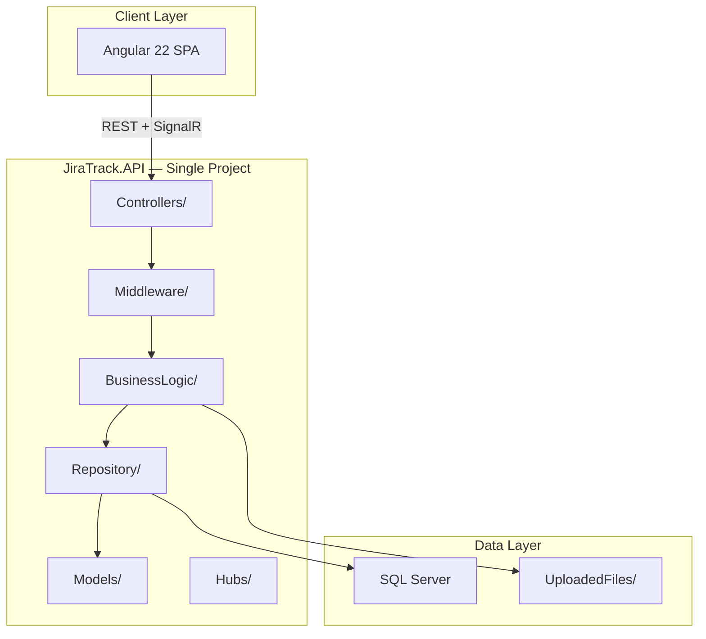
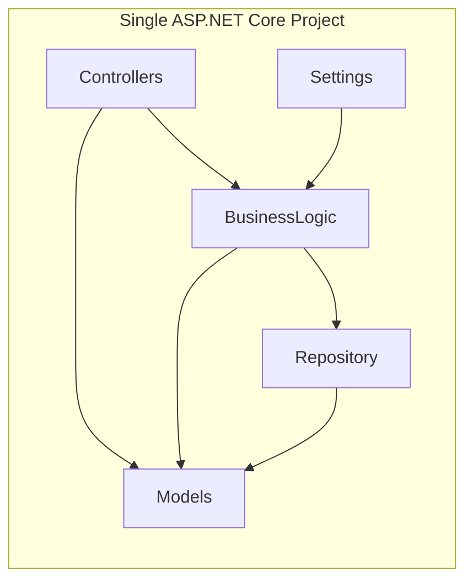
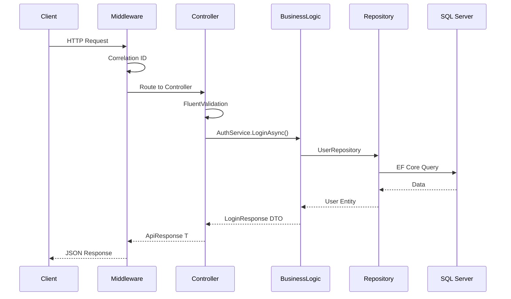

# Architecture — JiraTrack PM (MapsoftERP Style)

**Version:** 1.1  
**Date:** July 21, 2026  
**Pattern:** Single-project, folder-based layered architecture

---

## 1. High-Level Architecture

---

## 2. Folder-Based Layers (MapsoftERP Pattern)

**Same principles as Clean Architecture, organized as folders instead of separate projects:**

| Folder | Clean Architecture Equivalent |
|--------|--------------------------------|
| Models/Entities | Domain Layer |
| Models/DTOs + Validators | Application Layer (contracts) |
| BusinessLogic | Application Layer (services) |
| Repository | Infrastructure Layer |
| Controllers + Middleware | Presentation Layer |

---

## 3. Request Pipeline

---

## 4. Current Module Status

| Module | BusinessLogic | Controller | Repository | Status |
|--------|--------------|------------|------------|--------|
| M01 Auth | AuthService, TokenService | AuthController | UserRepository | Complete |
| M02 Users | Pending | Pending | Pending | Next |
| M03 Projects | Pending | Pending | Pending | Planned |

---

## 5. Cross-Cutting Concerns

| Concern | Location |
|---------|----------|
| Exception Handling | Middleware/ExceptionMiddleware.cs |
| JWT Authentication | Program.cs + BusinessLogic/TokenService.cs |
| Validation | Models/Validators/ + FluentValidation |
| Mapping | Models/Mappings/MappingProfile.cs |
| Logging | Serilog in Program.cs |
| Response Wrapper | Models/Common/ApiResponse.cs |
| Soft Delete | Models/Entities/BaseEntity.cs + EF query filters |
| API Versioning | Controllers/v1/ + Asp.Versioning |

---

## 6. Why Single Project?

Matches your existing **MapsoftERP** convention:
- One solution, one project, clear folders
- Easier navigation in Visual Studio
- Faster development for small-to-medium teams
- Still maintains separation of concerns via folders
- Repository Pattern + Unit of Work preserved
- All enterprise patterns retained (DTOs, validation, JWT, etc.)
