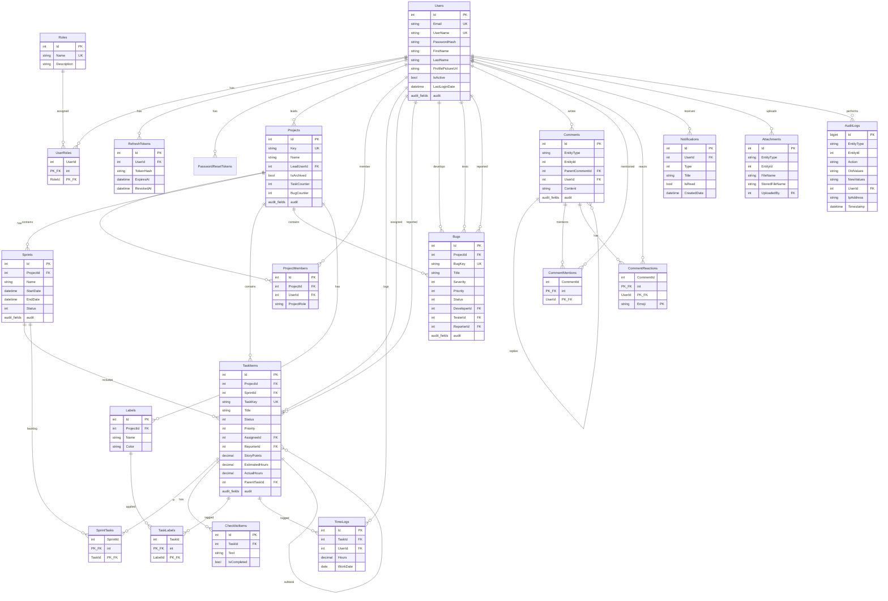
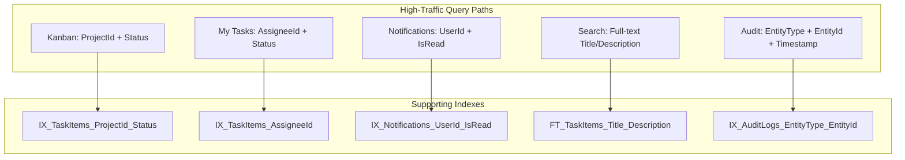
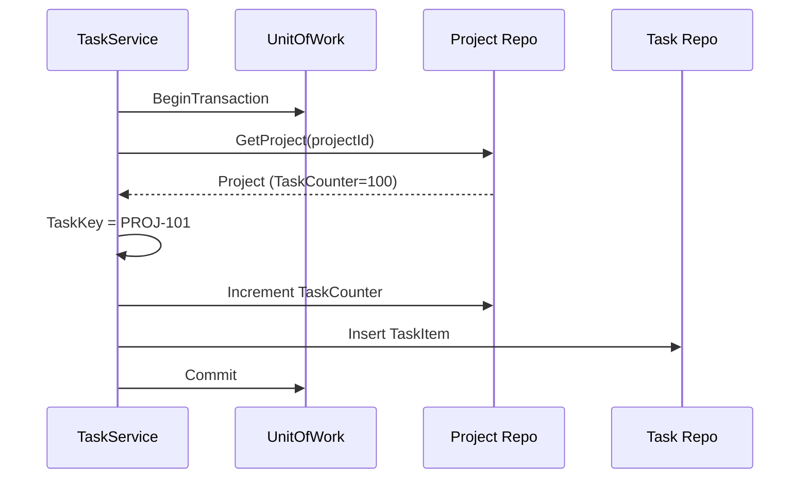

# ER Diagram — JiraTrack PM

**Version:** 1.0  
**Date:** July 21, 2026

---

## Entity Relationship Diagram

---

## Relationship Cardinality Notes

| Relationship | Type | Business Rule |
|--------------|------|---------------|
| User ↔ Role | M:N | Via UserRoles; user can have multiple roles |
| Project ↔ User | M:N | Via ProjectMembers; project-scoped role |
| Project → Sprint | 1:N | One project has many sprints; only one active |
| Project → Task | 1:N | Tasks belong to exactly one project |
| Sprint → Task | 1:N | Optional; task can be in backlog (null SprintId) |
| Task → Task | 1:N | Self-referencing for subtasks |
| Task ↔ Label | M:N | Via TaskLabels |
| Comment → Comment | 1:N | Nested replies, max depth 3 (app rule) |
| Attachment → Entity | Polymorphic | EntityType + EntityId pattern |

---

## Index Strategy Diagram

---

## Data Flow: Task Key Generation

