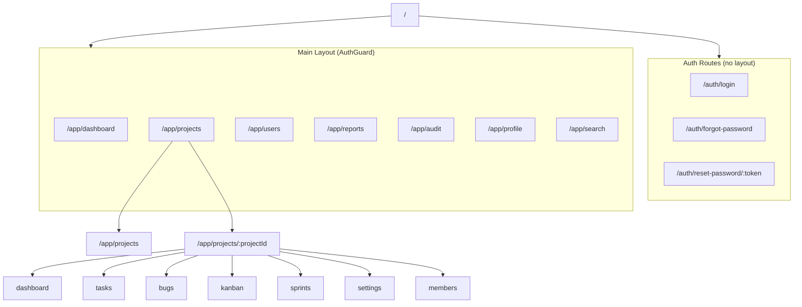

# Angular Routes — JiraTrack PM

**Version:** 1.0  
**Date:** July 21, 2026  
**Strategy:** Standalone components, lazy loading, route guards

---

## Route Tree



---

## app.routes.ts

```typescript
export const routes: Routes = [
  { path: '', redirectTo: 'app/dashboard', pathMatch: 'full' },

  // Auth — lazy, no main layout
  {
    path: 'auth',
    loadChildren: () => import('./features/auth/auth.routes').then(m => m.AUTH_ROUTES)
  },

  // Main app — lazy layout + child routes
  {
    path: 'app',
    canActivate: [authGuard],
    loadComponent: () => import('./layout/main-layout/main-layout.component')
      .then(m => m.MainLayoutComponent),
    children: [
      { path: '', redirectTo: 'dashboard', pathMatch: 'full' },
      {
        path: 'dashboard',
        loadChildren: () => import('./features/dashboard/dashboard.routes')
          .then(m => m.DASHBOARD_ROUTES)
      },
      {
        path: 'projects',
        loadChildren: () => import('./features/projects/projects.routes')
          .then(m => m.PROJECT_ROUTES)
      },
      {
        path: 'users',
        canActivate: [roleGuard],
        data: { roles: ['Admin'] },
        loadChildren: () => import('./features/users/users.routes')
          .then(m => m.USER_ROUTES)
      },
      {
        path: 'reports',
        canActivate: [roleGuard],
        data: { roles: ['Admin', 'ProjectManager', 'QA'] },
        loadChildren: () => import('./features/reports/reports.routes')
          .then(m => m.REPORT_ROUTES)
      },
      {
        path: 'audit',
        canActivate: [roleGuard],
        data: { roles: ['Admin'] },
        loadChildren: () => import('./features/audit/audit.routes')
          .then(m => m.AUDIT_ROUTES)
      },
      {
        path: 'profile',
        loadChildren: () => import('./features/profile/profile.routes')
          .then(m => m.PROFILE_ROUTES)
      },
      {
        path: 'search',
        loadComponent: () => import('./features/search/global-search/global-search.component')
          .then(m => m.GlobalSearchComponent)
      }
    ]
  },

  { path: '**', redirectTo: 'app/dashboard' }
];
```

---

## Feature Route Definitions

### Auth Routes (`auth.routes.ts`)

| Path | Component | Guard |
|------|-----------|-------|
| `/auth/login` | LoginComponent | guestGuard (redirect if logged in) |
| `/auth/forgot-password` | ForgotPasswordComponent | guestGuard |
| `/auth/reset-password/:token` | ResetPasswordComponent | guestGuard |

### Dashboard Routes (`dashboard.routes.ts`)

| Path | Component | Guard |
|------|-----------|-------|
| `/app/dashboard` | DashboardComponent | authGuard |

### Users Routes (`users.routes.ts`)

| Path | Component | Guard |
|------|-----------|-------|
| `/app/users` | UserListComponent | authGuard + roleGuard(Admin) |
| `/app/users/new` | UserFormComponent | authGuard + roleGuard(Admin) |
| `/app/users/:id/edit` | UserFormComponent | authGuard + roleGuard(Admin) |

### Projects Routes (`projects.routes.ts`)

| Path | Component | Guard |
|------|-----------|-------|
| `/app/projects` | ProjectListComponent | authGuard |
| `/app/projects/new` | ProjectFormComponent | authGuard + roleGuard(Admin, PM) |
| `/app/projects/:projectId` | ProjectDetailComponent | authGuard + projectMemberGuard |
| `/app/projects/:projectId/edit` | ProjectFormComponent | authGuard + roleGuard(Admin, PM) |
| `/app/projects/:projectId/settings` | ProjectSettingsComponent | authGuard + roleGuard(Admin, PM) |
| `/app/projects/:projectId/members` | ProjectMembersComponent | authGuard + roleGuard(Admin, PM) |

### Project Child Routes (nested under `:projectId`)

| Path | Component | Description |
|------|-----------|-------------|
| `/app/projects/:projectId/dashboard` | ProjectDashboardComponent | Project overview |
| `/app/projects/:projectId/tasks` | TaskListComponent | Task list |
| `/app/projects/:projectId/tasks/new` | TaskFormComponent | Create task |
| `/app/projects/:projectId/tasks/:taskId` | TaskDetailComponent | Task detail |
| `/app/projects/:projectId/tasks/:taskId/edit` | TaskFormComponent | Edit task |
| `/app/projects/:projectId/bugs` | BugListComponent | Bug list |
| `/app/projects/:projectId/bugs/new` | BugFormComponent | Create bug |
| `/app/projects/:projectId/bugs/:bugId` | BugDetailComponent | Bug detail |
| `/app/projects/:projectId/bugs/:bugId/edit` | BugFormComponent | Edit bug |
| `/app/projects/:projectId/kanban` | KanbanBoardComponent | Kanban board |
| `/app/projects/:projectId/sprints` | SprintListComponent | Sprint list |
| `/app/projects/:projectId/sprints/new` | SprintFormComponent | Create sprint |
| `/app/projects/:projectId/sprints/:sprintId` | SprintDetailComponent | Sprint detail + burndown |
| `/app/projects/:projectId/sprints/:sprintId/backlog` | SprintBacklogComponent | Sprint backlog |

### Reports Routes (`reports.routes.ts`)

| Path | Component | Roles |
|------|-----------|-------|
| `/app/reports` | ReportDashboardComponent | Admin, PM, QA |
| `/app/reports/developer` | DeveloperReportComponent | Admin, PM |
| `/app/reports/bugs` | BugReportComponent | Admin, PM, QA |
| `/app/reports/sprint/:sprintId` | SprintReportComponent | Admin, PM |
| `/app/reports/project/:projectId` | ProjectReportComponent | Admin, PM |
| `/app/reports/time-tracking` | TimeTrackingReportComponent | Admin, PM |

### Audit Routes (`audit.routes.ts`)

| Path | Component | Roles |
|------|-----------|-------|
| `/app/audit` | AuditLogListComponent | Admin |

### Profile Routes (`profile.routes.ts`)

| Path | Component |
|------|-----------|
| `/app/profile` | ProfileViewComponent |
| `/app/profile/change-password` | ChangePasswordComponent |

---

## Navigation Menu Structure

```typescript
export const NAV_ITEMS: NavItem[] = [
  { label: 'Dashboard',    icon: 'dashboard',     route: '/app/dashboard',           roles: ['*'] },
  { label: 'Projects',     icon: 'folder',          route: '/app/projects',            roles: ['*'] },
  { label: 'Users',        icon: 'people',          route: '/app/users',               roles: ['Admin'] },
  { label: 'Reports',      icon: 'assessment',      route: '/app/reports',             roles: ['Admin', 'ProjectManager', 'QA'] },
  { label: 'Audit Log',    icon: 'history',         route: '/app/audit',               roles: ['Admin'] },
];
```

### Project Sub-Navigation (contextual tabs)

```typescript
export const PROJECT_NAV: NavItem[] = [
  { label: 'Overview',  route: 'dashboard',  icon: 'dashboard' },
  { label: 'Tasks',     route: 'tasks',      icon: 'assignment' },
  { label: 'Bugs',      route: 'bugs',       icon: 'bug_report' },
  { label: 'Kanban',    route: 'kanban',     icon: 'view_kanban' },
  { label: 'Sprints',   route: 'sprints',    icon: 'speed' },
  { label: 'Members',   route: 'members',    icon: 'group' },
  { label: 'Settings',  route: 'settings',   icon: 'settings' },
];
```

---

## Guards Summary

| Guard | Purpose |
|-------|---------|
| `authGuard` | Redirect to `/auth/login` if not authenticated |
| `guestGuard` | Redirect to `/app/dashboard` if already authenticated |
| `roleGuard` | Check route `data.roles` against user roles |
| `projectMemberGuard` | Verify user is member of `:projectId` (or Admin) |

---

## Interceptors (applied globally)

| Interceptor | Purpose |
|-------------|---------|
| `authInterceptor` | Attach Bearer token; auto-refresh on 401 |
| `errorInterceptor` | Show snackbar on API errors |
| `loadingInterceptor` | Toggle global loading spinner |

---

## Route Count Summary

| Area | Routes |
|------|--------|
| Auth | 3 |
| Dashboard | 1 |
| Users | 3 |
| Projects (top-level) | 6 |
| Project child routes | 15 |
| Reports | 6 |
| Audit | 1 |
| Profile | 2 |
| Search | 1 |
| **Total** | **38** |
