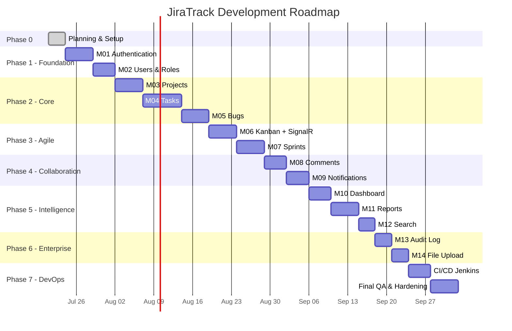

# Development Roadmap — JiraTrack PM

**Version:** 1.0  
**Date:** July 21, 2026  
**Estimated Duration:** 16–20 weeks (1 full-stack developer)  
**Approach:** Module-by-module delivery with SQL + Backend + Frontend + Tests + Docs per module

---

## Phase Overview



---

## Phase 0: Project Setup (Week 0)

**Deliverables:**
- [x] Functional Requirements
- [x] Non-Functional Requirements
- [x] Architecture Diagram
- [x] Folder Structure
- [x] Database Design + ER Diagram
- [x] API List
- [x] Angular Routes
- [x] UI Wireframes
- [x] Development Roadmap
- [ ] **Approval from stakeholder**

**Technical Setup (after approval):**
- Create `JiraTrack.sln` with Clean Architecture projects
- Create Angular 22 workspace with standalone config
- Configure SQL Server connection
- Setup Serilog, Swagger, CORS, API versioning
- Setup Angular Material theme (light/dark)
- Configure ESLint, Prettier, EditorConfig
- Create shared `ApiResponse<T>`, pagination models
- Create base entities, generic repository, unit of work
- Database migration infrastructure

---

## Module Delivery Template

Each module follows this checklist:

```
✅ SQL Script (tables, indexes, seed data if needed)
✅ Domain Entities + Enums
✅ EF Configurations + Migration
✅ Repository Interfaces + Implementations
✅ DTOs (Request/Response)
✅ AutoMapper Profiles
✅ FluentValidation Validators
✅ Application Services
✅ API Controllers (v1)
✅ Angular Models + Services
✅ Angular Components + Routes
✅ Guards / Interceptors (if needed)
✅ Unit Tests (Services + Validators)
✅ Integration Tests (Controllers)
✅ Postman Collection Update
✅ Module README Documentation
```

---

## Module Breakdown

### M01 — Authentication (Week 1)

| Layer | Deliverables |
|-------|-------------|
| Database | Users, Roles, UserRoles, RefreshTokens, PasswordResetTokens |
| Backend | AuthService, TokenService, AuthController, JWT middleware |
| Frontend | Login, Forgot Password, Reset Password, Profile, Change Password |
| Tests | Login validation, token refresh, password policy |
| Docs | Auth flow diagram, Postman auth collection |

**Exit Criteria:** User can register (admin-created), login, refresh token, change password, view profile

---

### M02 — User Management & Roles (Week 1–2)

| Layer | Deliverables |
|-------|-------------|
| Backend | UserService, UsersController, RoleController, role authorization |
| Frontend | User list, create/edit form, activate/deactivate, role assignment |
| Tests | CRUD operations, role guard, pagination/search |
| Docs | Permission matrix verification |

**Exit Criteria:** Admin can full CRUD users with role assignment and search/pagination

---

### M03 — Project Management (Week 2–3)

| Layer | Deliverables |
|-------|-------------|
| Database | Projects, ProjectMembers |
| Backend | ProjectService, ProjectsController, member management |
| Frontend | Project list, create/edit, detail shell, members, settings |
| Tests | Project key uniqueness, member authorization |
| Docs | Project module README |

**Exit Criteria:** PM can create projects, add members, archive, view project dashboard shell

---

### M04 — Task Management (Week 3–4)

| Layer | Deliverables |
|-------|-------------|
| Database | TaskItems, Labels, TaskLabels, ChecklistItems, TimeLogs |
| Backend | TaskService, full CRUD, subtasks, checklist, labels, time logs |
| Frontend | Task list, detail, form, checklist UI, label chips, subtasks |
| Tests | Task key generation, status transitions, subtask hierarchy |
| Docs | Task workflow documentation |

**Exit Criteria:** Full task lifecycle with all fields, subtasks, checklist, labels, time logging

---

### M05 — Bug Management (Week 4–5)

| Layer | Deliverables |
|-------|-------------|
| Database | Bugs table |
| Backend | BugService, status workflow, developer/tester assignment |
| Frontend | Bug list, detail, form with environment/browser/OS fields |
| Tests | Bug workflow transitions, severity/priority validation |
| Docs | Bug workflow state diagram |

**Exit Criteria:** Full bug lifecycle with workflow, assignments, and environment tracking

---

### M06 — Kanban Board + SignalR (Week 5–6)

| Layer | Deliverables |
|-------|-------------|
| Backend | KanbanService, KanbanHub, move/reorder endpoints |
| Frontend | Kanban board with CDK drag-drop, real-time updates |
| Tests | Move validation, SignalR hub tests |
| Docs | SignalR integration guide |

**Exit Criteria:** Drag-drop between 5 columns with live multi-user updates

---

### M07 — Sprint Management (Week 6–7)

| Layer | Deliverables |
|-------|-------------|
| Database | Sprints, SprintTasks |
| Backend | SprintService, start/close, velocity, burndown SP |
| Frontend | Sprint list, detail, backlog management, burndown chart |
| Stored Procs | sp_GetSprintBurndown |
| Tests | One active sprint rule, velocity calculation |

**Exit Criteria:** Full sprint lifecycle with burndown chart and velocity metrics

---

### M08 — Comments (Week 7–8)

| Layer | Deliverables |
|-------|-------------|
| Database | Comments, CommentMentions, CommentReactions |
| Backend | CommentService, nested comments, mentions parsing |
| Frontend | Comment thread component, @mention autocomplete, emoji reactions |
| Tests | Nesting depth, mention notification trigger |

**Exit Criteria:** Threaded comments with mentions and reactions on tasks/bugs

---

### M09 — Notifications (Week 8)

| Layer | Deliverables |
|-------|-------------|
| Database | Notifications |
| Backend | NotificationService, NotificationHub |
| Frontend | Notification bell, panel, real-time toast |
| Tests | Notification creation on events, SignalR delivery |

**Exit Criteria:** Real-time notifications for all defined event types

---

### M10 — Dashboard (Week 8–9)

| Layer | Deliverables |
|-------|-------------|
| Backend | DashboardService, aggregation queries |
| Frontend | Dashboard with cards, charts (ngx-charts), activity feed |
| Stored Procs | sp_GetProjectStatistics |
| Tests | Dashboard data accuracy |

**Exit Criteria:** Role-aware dashboard with charts and widgets

---

### M11 — Reports (Week 9–10)

| Layer | Deliverables |
|-------|-------------|
| Backend | ReportService, PDF export (QuestPDF), Excel export (ClosedXML) |
| Frontend | Report pages with filters and export buttons |
| Tests | Report data accuracy, export file generation |

**Exit Criteria:** All 5 report types with PDF and Excel export

---

### M12 — Global Search (Week 10)

| Layer | Deliverables |
|-------|-------------|
| Backend | SearchService, sp_GlobalSearch, full-text indexes |
| Frontend | Global search bar in toolbar, search results page |
| Tests | Search relevance, pagination, authorization |

**Exit Criteria:** Global search across projects, tasks, bugs with filters

---

### M13 — Audit Log (Week 10–11)

| Layer | Deliverables |
|-------|-------------|
| Database | AuditLogs |
| Backend | AuditInterceptor, AuditService, AuditController |
| Frontend | Audit log list with filters (Admin only) |
| Tests | Audit capture on CRUD, IP address logging |

**Exit Criteria:** Complete audit trail with searchable admin view

---

### M14 — File Upload (Week 11)

| Layer | Deliverables |
|-------|-------------|
| Database | Attachments |
| Backend | FileStorageService, FilesController, MIME validation |
| Frontend | FileUploadComponent, profile picture, attachment previews |
| Tests | File size limits, extension whitelist, auth on download |

**Exit Criteria:** Secure file upload/download for all entity types

---

## Phase 7: CI/CD & Hardening (Week 12–14)

### Jenkins Pipeline

```groovy
pipeline {
    stages {
        stage('Checkout') { ... }
        stage('Backend Build') { sh 'dotnet build' }
        stage('Backend Test') { sh 'dotnet test' }
        stage('Frontend Build') { sh 'npm ci && ng build --configuration=production' }
        stage('SonarQube') { ... }
        stage('Deploy Dev') { ... }
        stage('Deploy Staging') { ... }
        stage('Deploy Prod') { ... }
    }
}
```

### Final Hardening Checklist

- [ ] Security review (OWASP top 10)
- [ ] Performance testing (500 concurrent users)
- [ ] Accessibility audit (WCAG 2.1 AA)
- [ ] Cross-browser testing
- [ ] Mobile responsive verification
- [ ] API documentation complete in Swagger
- [ ] All unit tests passing (≥80% coverage)
- [ ] Integration tests passing
- [ ] Postman collection complete
- [ ] Deployment runbook

---

## Technology Versions

| Technology | Version |
|------------|---------|
| .NET | 9.0 |
| EF Core | 9.0 |
| Angular | 22.x |
| Angular Material | 19.x (M3) |
| SQL Server | 2019+ |
| SignalR | 9.0 |
| AutoMapper | 13.x |
| FluentValidation | 11.x |
| Serilog | 4.x |
| QuestPDF | 2024.x |
| ClosedXML | 0.102.x |
| xUnit | 2.x |
| Jasmine/Karma | Latest |

---

## Risk Register

| Risk | Impact | Mitigation |
|------|--------|------------|
| SignalR scale issues | Medium | Redis backplane in production |
| Large file uploads | Medium | Chunked upload, size limits, streaming |
| Full-text search performance | Low | Indexed FTS + pagination |
| Scope creep | High | Strict module boundaries, v1 out-of-scope list |
| Angular 22 breaking changes | Low | Pin versions, follow migration guides |

---

## Approval Gate

**This roadmap begins implementation only after approval of:**

1. Functional Requirements (`docs/01-functional-requirements.md`)
2. Non-Functional Requirements (`docs/02-non-functional-requirements.md`)
3. Architecture (`docs/03-architecture.md`)
4. Folder Structure (`docs/04-folder-structure.md`)
5. Database Design (`docs/05-database-design.md`)
6. ER Diagram (`docs/06-er-diagram.md`)
7. API List (`docs/07-api-list.md`)
8. Angular Routes (`docs/08-angular-routes.md`)
9. UI Wireframes (`docs/09-ui-wireframes.md`)
10. Development Roadmap (this document)

---

## Next Step After Approval

**Module M01 — Authentication** will be delivered as:

1. `database/scripts/M01_auth.sql`
2. `API/` — Full Clean Architecture solution bootstrap + Auth module
3. `APP/` — Angular workspace bootstrap + Auth screens
4. `postman/M01-auth.postman_collection.json`
5. `tests/` — Unit + Integration tests
6. `docs/modules/M01-authentication/README.md`

**Estimated delivery:** 5 working days after approval.
